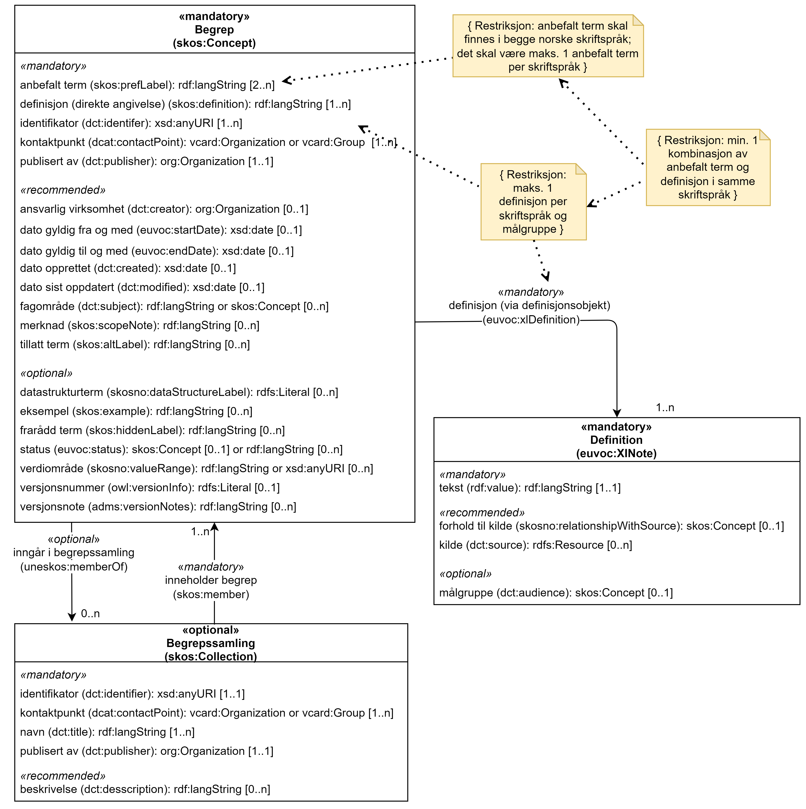

== Vedlegg B - Forenklet modell for SKOS-AP-NO-Begrep [[Forenklet-modell]]

_Vedlegget er deskriptivt_.

Ved eventuelle avvik mellom UML-diagrammene og prosatekst-beskrivelsene av kravene har prosatekst-beskrivelsene forrang.

=== Forenklet modell, med kun obligatoriske klasser og deres obligatoriske egenskaper

UML-diagrammet nedenfor viser de obligatoriske klassene med deres obligatoriske egenskaper, og relasjoner mellom disse.

[Figur-UML-kun-obligatoriske]
.Forenklet modell for SKOS-AP-NO-Begrep, med kun obligatoriske klasser og deres obligatoriske egenskaper. Se beskrivelse av den enkelte egenskapen for mer detaljert beskrivelse av restriksjonene.
[link=images/SKOS-AP-NO-Begrep-kun-obligatoriske.png]
image::images/SKOS-AP-NO-Begrep-kun-obligatoriske.png[alt="UML-diagram med to klasser, en relasjon og tre restriksjonsnoter. Innholdet er forklart i teksten."]

=== Forenklet modell, uten begrepsrelasjoner

[Figur-UML-uten-begrepsrelasjoner]
.UML-modell for SKOS-AP-NO-Begrep, uten begrepsrelasjoner mellom begreper. Se beskrivelse av den enkelte egenskapen for mer detaljert beskrivelse av restriksjonene.
[link=images/SKOS-AP-NO-Begrep-uten-relasjoner.png]

=== Forenklet modell, med kun begrepsrelasjoner

[Figur-kun-med-begrepsrelasjoner]
.UML-modell for SKOS-AP-NO-Begrep, kun med begrepsrelasjoner mellom begreper. Se beskrivelse av den enkelte egenskapen for mer detaljert beskrivelse av restriksjonene.
[link=images/SKOS-AP-NO-Begrep-kun-med-begrepsrelasjoner.png]

Det finnes andre typer assosiative begrepsrelasjoner i tillegg til de som er vist i figuren, som også kan brukes.
