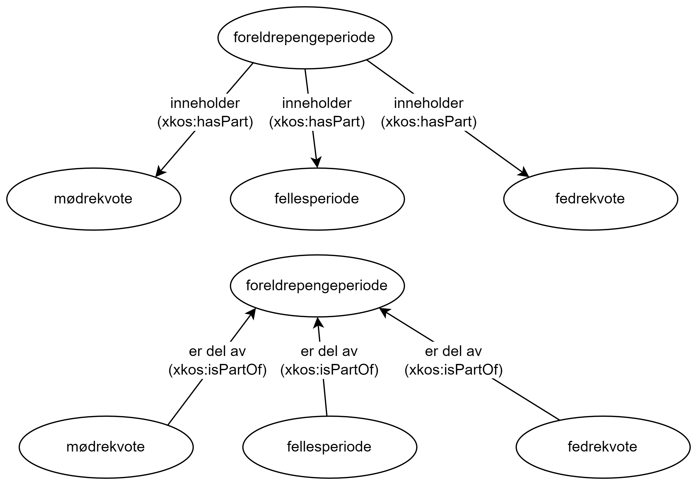
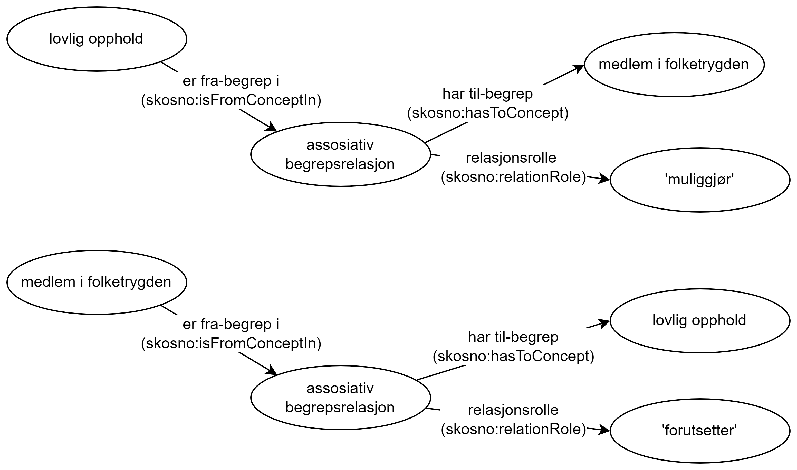

==== To måter i RDF å uttrykke en begrepsrelasjon på [[To-RDF-måter-begrepsrelasjon]]

I RDF kan vi uttrykke at et begrep har en relasjon til et annet begrep. Den enkleste måten å gjøre dette på, er en setning på formen «subjekt – predikat – objekt» der «predikat» er relasjonen. <<Figur-tre-partitive-relasjoner>> nedenfor viser tre partitive relasjoner som ‘foreldrepengeperiode’ har med tre andre begreper. Det kan være en fordel at de inverse relasjonene også uttrykkes eksplisitt, selv om en RDF-applikasjon skal kunne tolke den motsatte veien også.

[[Figur-tre-partitive-relasjoner]]
.Tre partitive relasjoner og den motsatte veien
[link=images/RDF-eksempel-partitivrelasjon.png]

Denne måten å uttrykke relasjoner på gir imidlertid ikke rom for å fortelle noe mer om selve relasjonen enn det som måtte ligge i selve predikatet. Når vi vil beskrive noe om selve relasjonen, må vi etablere den som et objekt, som vi utstyrer med den eller de egenskapene (attributtene) vi trenger å oppgi. Dette objektet blir da subjektet i neste setning. <<Figur-assosiativ-begrepsrelasjon>> nedenfor viser en assosiativ relasjon av typen «forutsetter – muliggjør». Selve relasjonen er her uttrykt som et objekt, for at vi skal kunne plassere relasjonsrollen. Spesielt for assosiative relasjoner via relasjonsobjekter, er det en fordel å uttrykke relasjonen begge veier i RDF.

[[Figur-assosiativ-begrepsrelasjon]]
.Assosiativ begrepsrelasjon uttrykt ved hjelp av relasjonsobjekt for at vi skal klare å uttrykke relasjonsrollen
[link=images/RDF-eksempel-assosiativrelasjon.png]

RDF gir muligheten til å bunte sammen begrepsrelasjoner som tar utgangspunktet i det samme begrepet og som har samme predikat. Hvis et begrep A inneholder flere andre begreper B, C og D, kan vi uttrykke dette på kortform slik:

-----
<begrepA> xkos:hasPart <begrepB> , <begrepC> , <begrepD> ; .
-----

[[Tabell-to-måter-begrepsrelasjon]]
.To ulike måter i RDF å relatere til et annet begrep på
[cols="20s,40,40"]
|===
| Relasjon | *Enten direkte relasjon*, ved å bruke | *eller via et relasjonsobjekt*, ved å bruke
| Generisk begrepsrelasjon | <<Begrep-spesialiserer>> , eller +
<<Begrep-generaliserer>> |<<Begrep-har-generisk-begrepsrelasjon>>
| Partitiv begrepsrelasjon |<<Begrep-er-del-av>>, eller +
<<Begrep-inneholder>> | <<Begrep-har-partitiv-begrepsrelasjon>>
| Assosiativ begrepsrelasjon |<<Begrep-er-relatert-til>> | <<Begrep-er-fra-begrep-i>>
|===
